# RSSGen 部署说明

RSSGen 基于 Leancloud 平台运行，你可以通过 Leancloud 提供的方式进行部署。本教程将搭配 [Coding](https://coding.net) 平台演示具体的部署流程（实际上，不仅是 coding 平台，包括 github 在内的任何 git 平台都支持部署本应用，只是由于部署时需要填写秘钥等信息所以支持免费创建私有项目的 coding 或者 csdn code 等平台会较为合适）

## 在 Leancloud 上创建新应用

在 Leancloud 上创建新应用，获取应用的APP秘钥

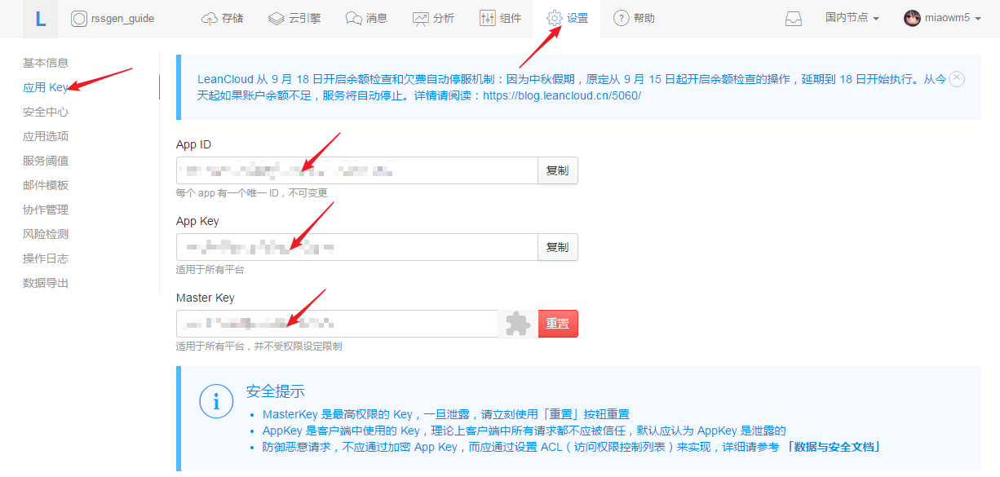

获取应用的部署公钥，并设置应用的域名

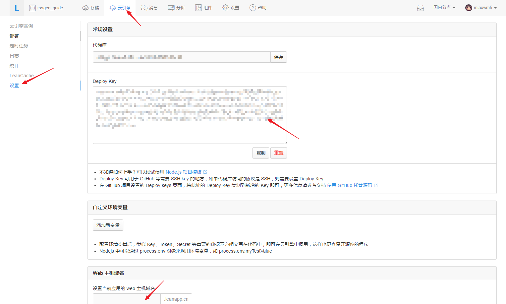

（国内节点创建的应用配置域名时需要实名认证，不希望进行认证可以切换到美国节点配置域名）

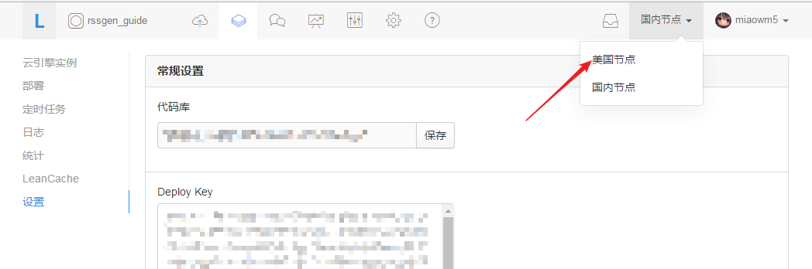

## 在 coding 上创建本项目

复制 RSSGen 的 git 地址

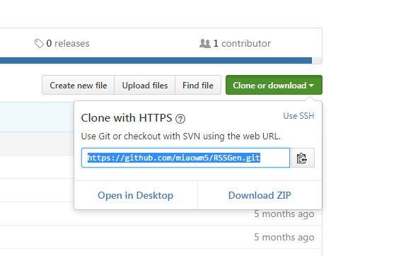

将 RSSGen 导入到 coding

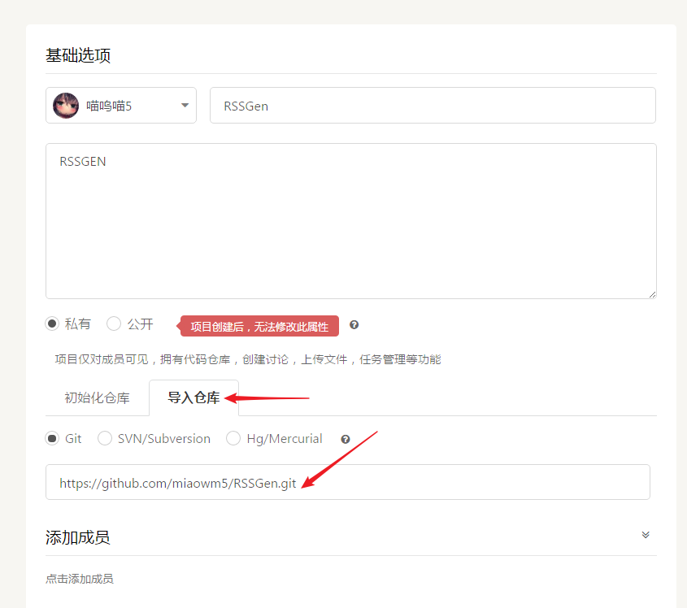

进入代码界面，修改 auth.py 文件，填写上一节中的 APP 秘钥

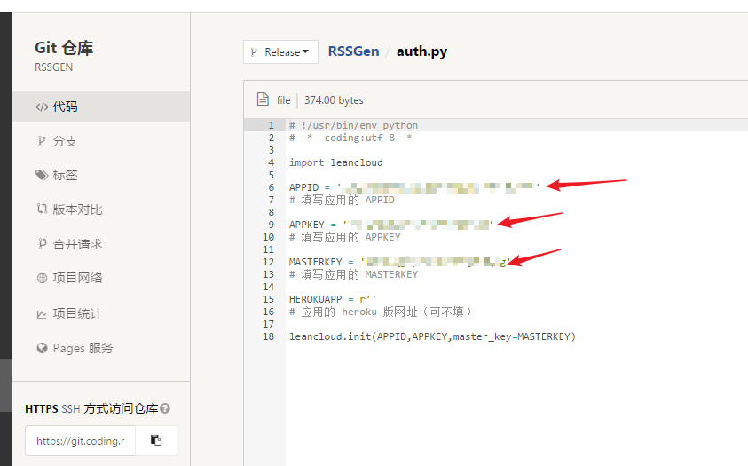

进入部署公钥设置界面，填写上一节中的部署公钥

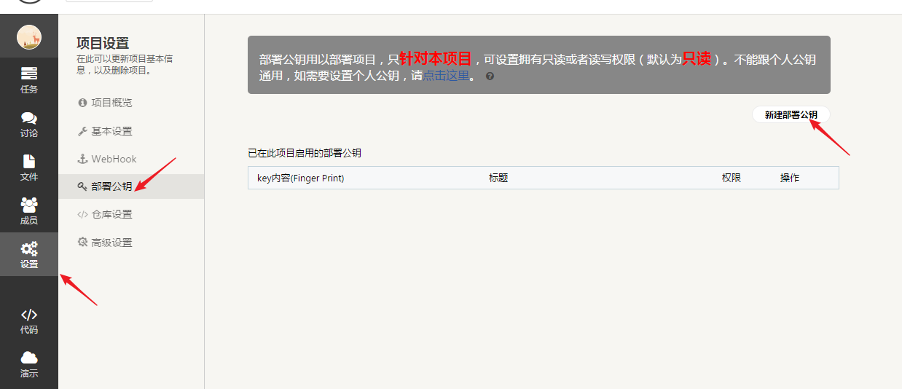

## 部署项目

复制 coding 平台项目的 git 地址，填写到 leancloud 平台上对应位置

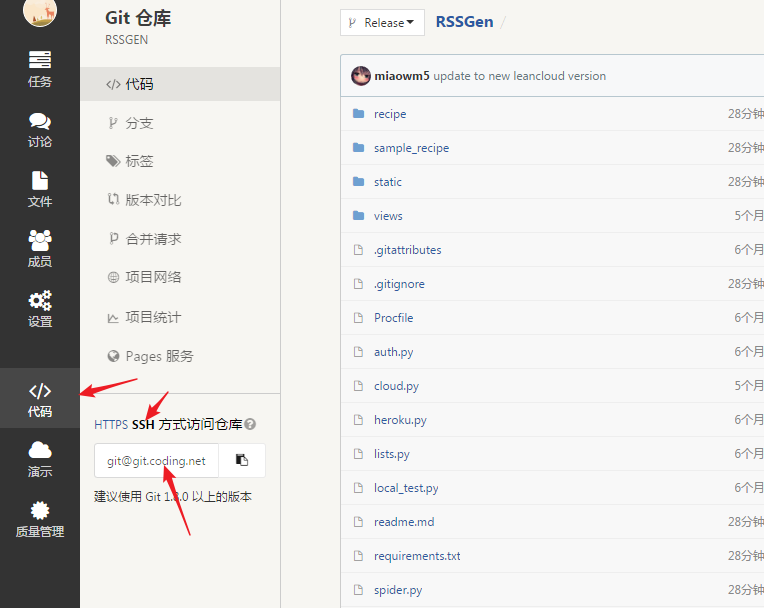

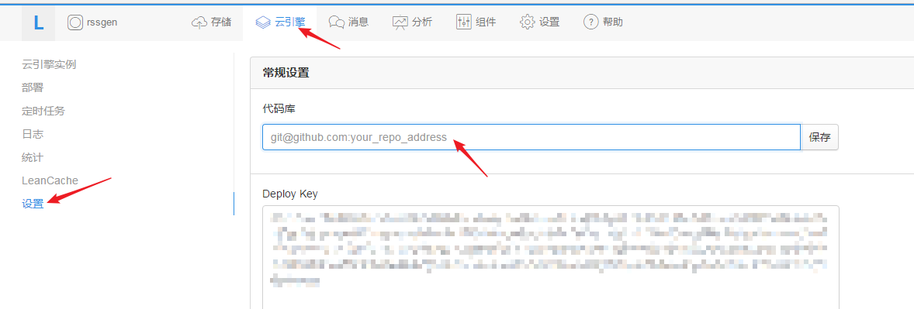

进入部署界面，版本号填写 Release ，点击部署，等待部署完成

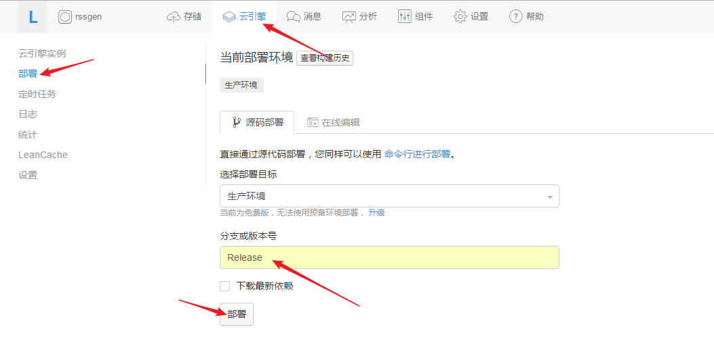

进入设置的域名，查看部署是否成功

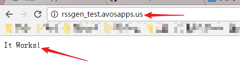

## 添加新的 RSS 抓取规则

打开 应用域名/rss 可以查看当前应用所拥有的所有 rss，默认情况下，应用不包含任何 rss 抓取规则

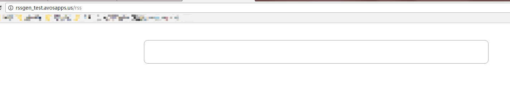

进入 coding 平台对应项目的 master 分支下，复制 sample_recipe 目录下的范例抓取规则到 recipe 目录下，或者在 recipe 目录下自己新建所需的规则

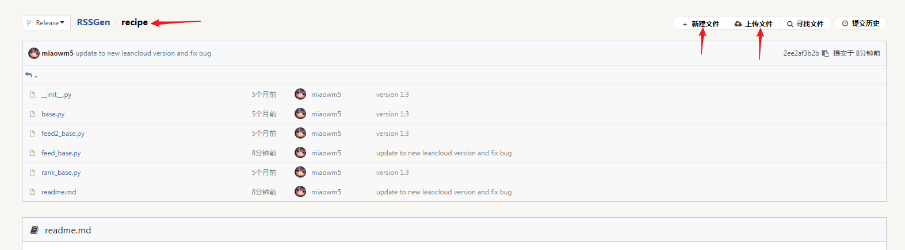

重新回到 leancloud 平台，再次进行部署

进入对应域名下的 rss 子域名中，查看规则是否成功导入，如果成功导入，则点击立刻更新后即可开始抓取 RSS，对应的网页地址即为 RSS 地址

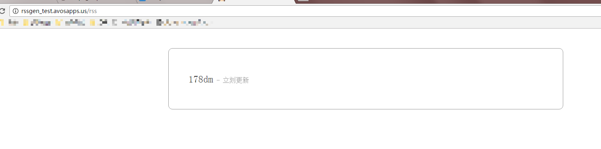

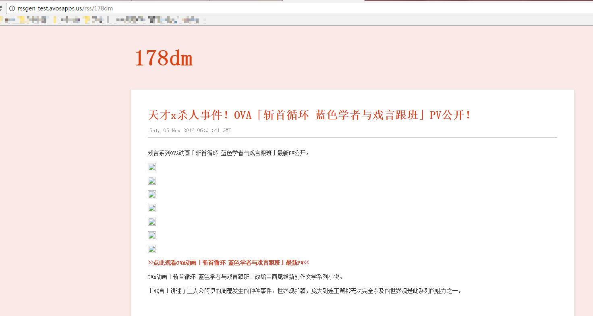

## 自动更新 RSS

默认情况下，RSS 只会手动更新，通过添加 leancloud 定时任务，RSS 可以自动进行更新

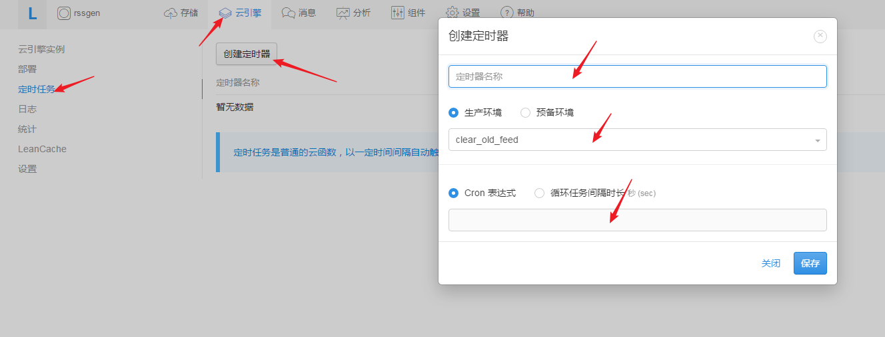

| 函数名称           | Cron表达式         | 说明             |
| -------------- | --------------- | -------------- |
| clear_old_feed | 0 0,5 0 * * ?   | 每天凌晨删除过期的 RSS  |
| spider_work    | 0 0,5 0/6 * * ? | 每隔六小时抓取一次网站的更新 |

## 部署到 Heroku

设置好 auth.py 的应用可以直接上传到 Heroku 平台，Heroku 版拥有除了定时任务外网页版全部的功能，所有的数据仍然保存在 leancloud 中，部署到 Heroku 主要用于抓取墙外网页的更新生成 RSS

推荐使用 Dropbox 方式部署应用